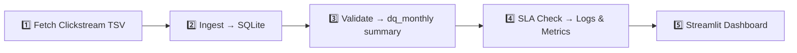

# Event Log Quality Monitor (Wikipedia Clickstream)

> **A hands-on prototype for end-to-end data quality and SLA monitoring** </br>
> Stack: FastAPI · SQLite · Pandas · Streamlit

## Demo

[placeholder for video]()


## Objective

This project is an **end-to-end prototype** that continuously **checks, validates, and visualizes** the health of Wikipedia's Clickstream logs.

It was my way to think through, design, and solve the kinds of challenges engineers face when building a data pipeline from scratch —
from ingestion stability and idempotent ETL design to data validation and SLA monitoring.

Through this, I wanted to explore what it really means to build **a trustworthy and observable data system** from the ground up —
not just moving data, but ensuring its quality, reliability, and explainability.


## The Dataset

Wikipedia Clickstream tracks how users move between pages — essentially an event log of navigation patterns.
| Column | Description |
| ----------- |------------- |
| `prev` | Referrer page title |
| `curr` | Current page title |
| `type` | Type of link (`link`, `external`, or `other`) |
| `n` | Number of times users moved from `prev` to `curr`|

Each monthly file (e.g., clickstream-enwiki-2025-09.tsv) contains 30M+ rows,
large enough to surface real-world challenges such as slow ingestion, schema drift, and consistency management. [Learn more about the dataset](https://meta.wikimedia.org/wiki/Research:Wikipedia_clickstream).


## System Flow



**1. Fetch**: Download monthly Clickstream TSVs automatically.

**2. Ingest**: Load and clean data in chunks (500k rows per batch), ensuring idempotent insertion by deleting old data for the same month.

**3. Validate**: Compute data-quality metrics (null rate, duplicate rate, range errors, schema validity) and store them in `dq_monthly`.

**4. SLA Check**: Compare metrics month-over-month and log warnings when thresholds (e.g., >30% volume drop) are breached.

**5. Dashboard**: Visualize trends and SLA compliance with Streamlit.


## Installation & Quick Run

```bash
# Install dependencies
make init

# Fetch, ingest, validate, and check SLA for demo months
make seed_demo MONTHS=2025-08,2025-09 LANG=enwiki

# Run FastAPI metrics server
make serve

# Open Streamlit dashboard
make dashboard
```


## Key Design Decisions

**Efficient Ingestion**

- **Chunked reads** keep memory usage stable on 30M+ rows while enabling incremental writes.
- **B-tree index** on `load_month` optimizes month-based filtering and makes validation queries fast.
- **WAL mode + NORMAL sync** provide ~30% faster writes compared to rollback mode while retaining durability.

**Idempotent Pipeline**

- Each run starts by deleting data for the same month before insert ensuring re-runs don't create duplicates.
- Malformed or skipped lines are logged into an `ingest_audit` table for traceability and future anomaly tracking.
- Both `validate` and `sla_check` are re-runnable and deterministic, producing consistent summaries for each month.

**Data Quality Metrics**

- Calculated monthly and stored in `dq_monthly` as:
  - `null_rate` (empty-string and NaN handling)
  - `duplicate_rate` (based on `(prev, curr, type)` uniqueness)
  - `range_error_rate` (detects negative or invalid `n` values)
- Acts as a lightweight observability layer, enabling trend visualization and anomaly detection over time.

**SLA Monitoring**

- Compares **volume, null rate, and schema validity** against the previous month’s baselines.
- Logs warnings when deviations exceed defined thresholds (e.g., volume drop > 30%).
- Streamlit dashboard visualizes these changes and trends with contextual annotations.

**Observability & Transparency**

- Unified structured logging is used across all stages for ingestion, validation, and SLA checks.
- FastAPI's `/metrics` endpoint exposes real-time and historical DQ summaries for external monitoring.
- Streamlit uses `st.cache_data` to avoid redundant database queries and keep UI interactions fast.

### Reflection - Balancing Production Realism with Demo Agility
> Each design choice reflects a deliberate trade-off between production realism and rapid experimentation.
> 
> The goal was not to build a full enterprise-scale DQ platform, but to think through the core building blocks of one: idempotent ingestion, transactional durability, metric caching, and anomaly detection.
>
> This prototype serves as a sandbox to reason about those principles end-to-end — from raw ingestion to visual SLA validation —
and to practice the mindset of building data systems that are both reliable and observable by design.

## Folder Structure

```bash
event-log-quality-monitor/
├── pipeline/
│   ├── fetch_clickstream.py
│   ├── ingest.py
│   ├── validate.py
│   ├── sla_check.py
│   ├── seed_demo.py
│   └── inject_anomaly.py
├── app/
│   ├── api.py
│   └── dashboard.py
├── data/
│   ├── raw/
│   ├── processed/
│   └── demo/
├── tests/
├── db/
└── Makefile

```
